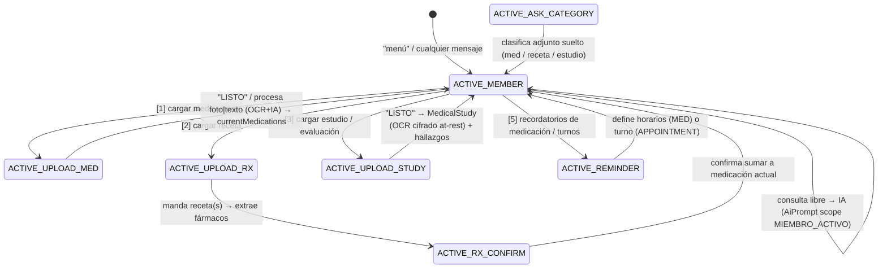

# Bio-Pass — Máquina de estados del bot de WhatsApp

> Estado persistido en `User.onboardingState`. Buffer temporal del registro en `User.onboardingData` (JSON).
> Motor: `backend/src/whatsapp/bot-state-machine.ts` → `BotStateMachine.handleMessage()`.
> El simulador web (`POST /api/bot/simulate-message`) y WhatsApp (Baileys) llaman a la MISMA función.

## Comandos globales (funcionan en cualquier estado)

| Entrada del usuario | Efecto |
|---|---|
| `REINICIAR`, "empezar de nuevo", "menú", "cancelar", "volver a empezar", "de nuevo" | Registro → vuelve a `STEP1_WELCOME`. Miembro activo → `ACTIVE_MEMBER` (sin borrar datos). |
| `RECUPERAR PIN` / "olvidé mi PIN" | Entra al flujo de recuperación (doble OTP + selfie + Recovery Key). |

## Onboarding (self-service, 0 asistencia)

```mermaid
stateDiagram-v2
    [*] --> UNREGISTERED : primer mensaje

    UNREGISTERED --> STEP1_WELCOME : se crea el User (status=PENDING_PAYMENT)
    STEP1_WELCOME --> STEP1B_TERMS : elige idioma [1 ES / 2 GN / 3 PT / 4 EN]
    STEP1B_TERMS --> STEP2_DOCUMENT : responde "ACEPTO" (guarda termsAcceptedAt)

    STEP2_DOCUMENT --> STEP2_DOCUMENT : foto/audio/texto sin nombre+CI legibles → re-pide foto
    STEP2_DOCUMENT --> STEP2_CONFIRM_CI : OCR/texto extrae nombre + Nº de cédula
    STEP2_CONFIRM_CI --> STEP2_DOCUMENT : "2" / "no" / "corregir" → pide otra foto (limpia buffer)
    STEP2_CONFIRM_CI --> STEP2_CONFIRM_CI : respuesta ambigua → re-muestra la confirmación
    STEP2_CONFIRM_CI --> STEP3_CONTACT : "1" / "sí" / "dale" / "ok" / 👍

    STEP3_CONTACT --> STEP4_ADDRESS  : nombre + teléfono del contacto de emergencia
    STEP4_ADDRESS --> STEP5_EMAIL    : dirección
    STEP5_EMAIL --> STEP6_CONDITIONS : correo electrónico
    STEP6_CONDITIONS --> STEP6B_BLOOD : condiciones (lista editable /admin) + alergias
    STEP6B_BLOOD --> STEP7_PIN       : grupo sanguíneo / RH
    STEP7_PIN --> STEP7B_RECOVERY    : crea PIN de 4 dígitos (deriva clave ZK)
    STEP7B_RECOVERY --> STEP8_PAYMENT : muestra Recovery Key (16) → "YA GUARDÉ MI CLAVE"

    STEP8_PAYMENT --> AWAITING_PAYMENT_CONFIRMATION : elige país+plan → se genera PaymentOrder
    AWAITING_PAYMENT_CONFIRMATION --> AWAITING_PAYMENT_CONFIRMATION : "PAGAR" → consulta real al PSP (Bancard confirm); sigue PENDING
    AWAITING_PAYMENT_CONFIRMATION --> ACTIVE_MEMBER : webhook del PSP confirma → status=ACTIVE, se envía QR + PDF de stickers

    RESET_PIN --> ACTIVE_MEMBER : (reset por admin) captura PIN nuevo, re-cifra la bóveda
    RESET_PIN --> STEP8_PAYMENT : (reset por admin, si aún no pagó)
```

## Miembro activo (`status = ACTIVE`)

## Vencidos / cancelados / purgados

```mermaid
stateDiagram-v2
    ACTIVE_MEMBER --> EXPIRED   : CRON, expiryDate vencida (status=EXPIRED)
    EXPIRED --> CANCELLED       : CRON día +4 (status=CANCELLED, finePending=true)
    CANCELLED --> PURGED        : CRON día +30 sin pago → purga física GDPR/LGPD
    EXPIRED --> ACTIVE_MEMBER   : "PAGAR" + webhook OK (renovación)
    CANCELLED --> ACTIVE_MEMBER : paga cuota + multa (Gs. 50.000 / R$ 44) + webhook OK
    PURGED --> [*]              : datos eliminados; requiere registro nuevo desde cero
```

## Notas

- **Idempotencia de estado**: cada mensaje entrante re-evalúa `onboardingState`; los pasos guardan primero en `onboardingData` y solo avanzan de estado cuando el dato requerido es válido.
- **Acumulación en STEP2**: frente + dorso de la cédula (y foto + audio + texto) se combinan sin pisar un dato bueno con uno vacío (`keepBest`).
- **Reingreso**: un usuario `ACTIVE` que escribe "reiniciar" NO pierde su ficha; solo vuelve al menú.
- **Recuperación de PIN**: `RECUPERAR PIN` → OTP SMS + OTP email → selfie con cédula y papel fechado → Recovery Key de 16 → el servidor descifra el envelope del PIN y re-cifra la bóveda con el PIN nuevo.
